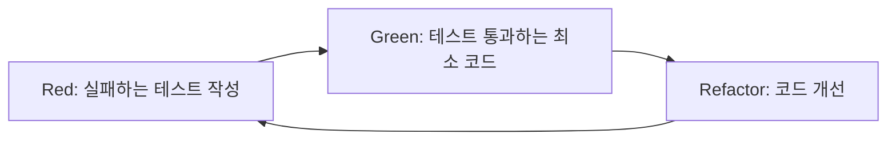

# 테스트 전략 및 TDD 가이드

## 📋 목차

1. [테스트 피라미드](#테스트-피라미드)
2. [TDD 프로세스](#tdd-프로세스)
3. [테스트 작성 가이드](#테스트-작성-가이드)
4. [커버리지 목표](#커버리지-목표)
5. [CI/CD 통합](#cicd-통합)

## 테스트 피라미드

우리 프로젝트는 다음과 같은 테스트 피라미드를 따릅니다:

```
         /\
        /E2E\       (5%)  - Playwright를 사용한 E2E 테스트
       /------\
      /통합 테스트\   (20%) - API, 서비스 레이어 통합 테스트
     /------------\
    /  단위 테스트  \  (75%) - 함수, 컴포넌트 단위 테스트
   /________________\
```

## TDD 프로세스

### 1. Red-Green-Refactor 사이클



### 2. TDD 실천 예시

```typescript
// 1. RED: 실패하는 테스트 먼저 작성
describe('calculateDiscount', () => {
  it('10% 할인을 적용해야 함', () => {
    expect(calculateDiscount(100, 0.1)).toBe(90);
  });
});

// 2. GREEN: 테스트를 통과하는 최소한의 코드
function calculateDiscount(price: number, discount: number): number {
  return price - price * discount;
}

// 3. REFACTOR: 코드 개선
function calculateDiscount(price: number, discountRate: number): number {
  if (price < 0 || discountRate < 0 || discountRate > 1) {
    throw new Error('Invalid input');
  }
  return price * (1 - discountRate);
}
```

## 테스트 작성 가이드

### 1. 테스트 구조 (AAA 패턴)

```typescript
describe('UserService', () => {
  it('사용자를 생성해야 함', async () => {
    // Arrange (준비)
    const userData = { name: '홍길동', email: 'hong@example.com' };
    const userService = new UserService();

    // Act (실행)
    const user = await userService.createUser(userData);

    // Assert (검증)
    expect(user).toMatchObject(userData);
    expect(user.id).toBeDefined();
  });
});
```

### 2. 테스트 명명 규칙

- 한국어로 명확하게 작성
- "~해야 함" 형태로 기대 동작 명시
- 구체적인 시나리오 설명

```typescript
// ❌ 나쁜 예
it('test user creation');

// ✅ 좋은 예
it('이메일이 중복된 경우 에러를 발생시켜야 함');
```

### 3. 테스트 격리

```typescript
describe('OrderService', () => {
  let orderService: OrderService;
  let mockDatabase: MockDatabase;

  beforeEach(() => {
    // 각 테스트마다 새로운 인스턴스 생성
    mockDatabase = new MockDatabase();
    orderService = new OrderService(mockDatabase);
  });

  afterEach(() => {
    // 테스트 후 정리
    mockDatabase.clear();
  });
});
```

## 커버리지 목표

### 전체 목표

- **Lines**: 80% 이상
- **Branches**: 80% 이상
- **Functions**: 80% 이상
- **Statements**: 80% 이상

### 파일별 목표

- **비즈니스 로직**: 95% 이상
- **유틸리티 함수**: 100%
- **API 클라이언트**: 90% 이상
- **UI 컴포넌트**: 70% 이상

### 커버리지 제외 대상

- 설정 파일
- 타입 정의 파일
- 목업 데이터
- 테스트 파일

## CI/CD 통합

### 1. Pre-commit 검사

- 코드 포맷팅
- 린트 검사
- 타입 체크
- 관련 테스트 실행

### 2. PR 검사

- 전체 테스트 실행
- 커버리지 리포트
- 코드 품질 검사
- 보안 취약점 스캔

### 3. 머지 후

- 커버리지 배지 업데이트
- 성능 테스트
- E2E 테스트

## 테스트 도구

### 단위 테스트

- **Vitest**: 빠른 실행 속도
- **Testing Library**: 컴포넌트 테스트
- **MSW**: API 모킹

### 통합 테스트

- **Supertest**: HTTP 테스트
- **Testcontainers**: DB 통합 테스트

### E2E 테스트

- **Playwright**: 크로스 브라우저 테스트
- **Cypress**: 컴포넌트 E2E

## 베스트 프랙티스

### 1. 테스트 우선 개발

- 기능 구현 전 테스트 작성
- 테스트가 API 설계 가이드 역할

### 2. 작은 단위로 테스트

- 한 번에 하나의 동작만 테스트
- 복잡한 시나리오는 여러 테스트로 분리

### 3. 명확한 실패 메시지

```typescript
// 커스텀 매처 사용
expect(user.age).toBeGreaterThan(17, '사용자는 18세 이상이어야 합니다');
```

### 4. 테스트 데이터 팩토리

```typescript
// 테스트 데이터 생성 유틸리티
const createTestUser = (overrides = {}) => ({
  id: faker.datatype.uuid(),
  name: faker.name.fullName(),
  email: faker.internet.email(),
  ...overrides,
});
```

## 지속적 개선

- 매주 테스트 커버리지 리뷰
- 분기별 테스트 전략 회고
- 테스트 실행 시간 모니터링
- 플레이키 테스트 제거
